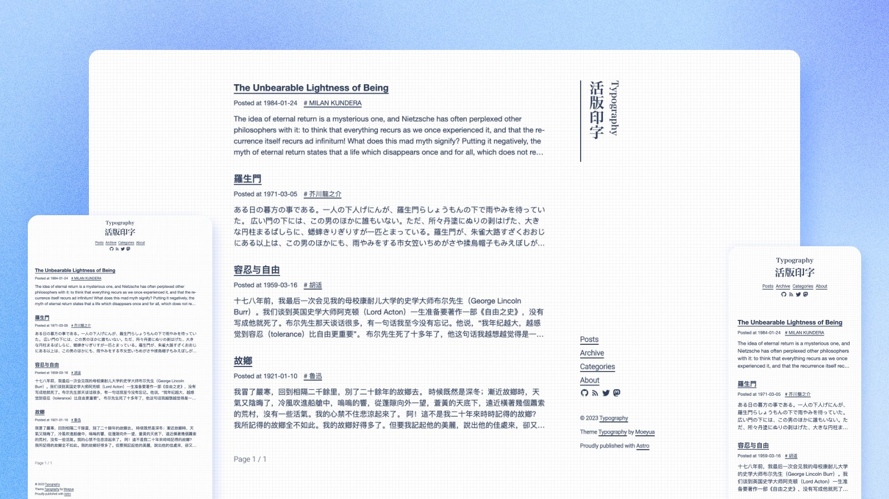

# Typography

  

<h6 align='center'>
<a href="https://astro-theme-typography.vercel.app/">Live Demo</a>
</h6>
<h5 align='center'>
<b>This work is rewrite from <a href="https://github.com/sumimakito/hexo-theme-typography">hexo-theme-Typography</a></b>
</h5>

<b>English</b> | <a href="./README.zh-CN.md">简体中文</a>

## Features

- Build with **Astro**, **TypeScript** and **UnoCSS**
- **Fast**. 100% [Pagespeed Score](https://pagespeed.web.dev/analysis/https-astro-theme-typography-vercel-app/j34nq9tx0s?form_factor=desktop).
- **Typography** Derived from prevalent Chinese typographic norms and aims to provide an enhanced reading experience for website visitors.
- **Responsive**. Responsive and works well on all screen sizes.
- **Accessible**. A well thought out semantic and accessible content.
- **SEO friendly**.Open Graph and Twitter Cards support for a better social sharing experience.
- **Sitemap** and **RSS feed** for search engines.
- i18n support.
- Support Disqus, Giscus, Twikoo as comment service.
- Dark mode support.

## Demo

> Submit a PR to add your blog Demo.

- [Live Demo](https://astro-theme-typography.vercel.app/)
- [My Blog](https://blog.moeyua.com/)

