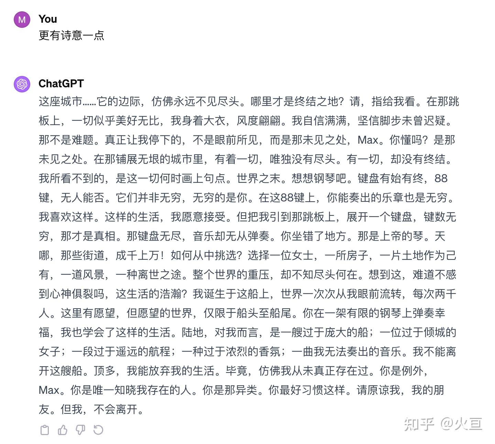

先说我的结论吧：
*<u>1900不上岸是因为对于无尽恐惧，柯希莫不下树是他对于人生的选择。</u>*

#### 1900:

(《海上钢琴师》是几年前之前看的了，可能情节有些记不太清楚，如有错请指正（别喷我QAQ）。)
  
#### 关于爱情:

爱 (The Girl) ：驱使1900下岸，但是1900却因为恐惧最终没有迈出那一步。

以下是原台词 (偷懒直接全复制了，有点长)：

<blockquote>
  
Christ, did you... did you see the streets, just the streets? There were thousands of them! Then how you do it down there, how do you choose just one... one woman, one house, one landscape to look at, one way to die...?All that city... You just couldn't see an end to it. The end! Please, could you show me where it ends? It was all very fine on that gangway and I was grand, too, in my overcoat. I cut quite a figure and I had no doubts about getting off. Guaranteed. That wasn't a problem. It wasn't what I saw that stopped me, Max. It was what I didn't see. Can you understand that? What I didn't see. In all that sprawling city, there was everything except an end. There was everything. But there wasn't an end. What I couldn't see was where all that came to an end. The end of the world. Take a piano. The keys begin, the keys end. You know there are 88 of them and no-one can tell you differently. They are not infinite, you are infinite. And on those 88 keys the music that you can make is infinite. I like that. That I can live by. But you get me up on that gangway and roll out a keyboard with millions of keys, and that's the truth, there's no end to them, that keyboard is infinite. But if that keyboard is infinite there's no music you can play. You're sitting on the wrong bench. That's God's piano. Christ, did you see the streets? There were thousands of them! How do you choose just one? One woman, one house, one piece of land to call your own, one landscape to look at, one way to die. All that world weighing down on you without you knowing where it ends. Aren't you scared of just breaking apart just thinking about it, the enormity of living in it? I was born on this ship. The world passed me by, but two thousand people at a time. And there were wishes here, but never more than could fit on a ship, between prow and stern. You played out your happiness on a piano that was not infinite. I learned to live that way. Land is a ship too big for me. It's a woman too beautiful. It's a voyage too long. Perfume too strong. It's music I don't know how to make. I can't get off this ship. At best, I can step off my life. After all, it's as though I never existed. You're the exception, Max. You're the only one who knows that I'm here. You're a minority. You'd better get used to it. Forgive me, my friend. But I'm not getting off.

</blockquote>

如果看不懂原文以下是ChatGPT的翻译：

<image></image>

#### From 导演的角度：
当然我们也可以从导演的角度来看看：

《钢琴师》导演是意大利人，所以也可以理解为是导演不愿意让1900下船。船象征着欧洲文明往日的辉煌，陆地象征着灯塔国的兴起。作为一个二十世纪末的Italian，这或许承载着导演对于往事的怀念。

#### 柯希莫：
同样是关于爱情：
同样是因为爱情，当伯爵劝说柯希莫为了乌苏拉（第二任）下树时：

 > “你要后退吗？” 伯爵大声嚷。

 > “不，是抵抗。” 男爵回答。

以及同薇莪拉（初恋）的对话：

>  柯希莫把眼光投到她身上。 而她在说：“你不认为爱情是绝对的献身，放弃自己……” 

>  她站在草地上，显得比过去任何时候都漂亮，脸上的表情冷若冰霜。如果他的态度稍加改变就能够融化掉她的冷气，就能将她重新拥进怀……柯希莫可以说几句、随便几句迎合她的话，他以说：“告诉我你要我做什么，我准备……”，他的幸福将重新到来，幸福不会再有阴影。

> 

>  而他却说：<u>“如果不充满力量地保持自我，就不可能有爱情。”</u>

#### 关于选择：

小时候：
> “喂，你们下面的，拴好狗！”他们大声嚷嚷着，“让他下来！少爷，您可以下树了，您当心，树很高哇！您等一等，我们替您搭一副梯子吧！然后我们送您回家去！” 

> “不，多谢，多谢，”我哥哥说道，<u>“你们别费神了，我认识我的路，我知道我要走的路！”</u>

和军官的对话：

> “我也是。”柯希莫回答道，<u>“许多年以来，我为一些连对我自己都解释不清的理想而活着，但是我做了一件好事情：生活在树上。”</u>

#### 同样是从作者的角度：

以下是后记：

> “我让这个不愿像别人一样在地上行走的人物不变成一个厌世者，而变成一个不断为众人谋利益的男子汉，投身于那个时代的运动，愿意全面参与积极生活：从技术进步到地方治理和精致生活。只有这样写，我才有兴趣动笔。但是他始终认为，为了与他人真正在一起，唯一的出路是与他人相疏离，他在生命的每时每刻都顽固地为自己和为他人坚持那种不方便的特立独行和离群索居。这就是他作为诗人、探险者、革命者的志趣。”

觉得有几分道理可以去知乎上帮我点个赞 -> [知乎的回答](https://www.zhihu.com/question/535634346)